:::{.cr-section layout="sidebar-left"}

:::{focus-on="cr-cover"}
# Identitätsmanagement in EMIGA

### Anleitung für Standardnutzende

Diese Seite informiert Sie über das Identitätsmanagement in EMIGA. Sie lernen

- was Identitätsmanagement bedeutet,
- wie Sie sich authentifizieren können,
- was Sie tun können, wenn Ihr Konto gesperrt wurde,
- und wo Sie Support erhalten, falls Sie Probleme haben.

:::

:::{#cr-cover .scale-to-fill}

:::

:::{focus-on="cr-cover"}
[Teil 1 · Grundlagen]{.idm-kicker}

## Was ist das Identitätsmanagement?

Die Abkürzung **IDM** steht für Identitätsmanagement. Dabei verwaltet die Administration einer Einrichtung die Nutzendenkonten der Einrichtung in EMIGA. Über dieses System können Konten erstellt und verwaltet werden, zum Beispiel indem Rollen und Zugriffsrechte festgelegt werden.
:::

:::{focus-on="cr-webauthn"}
## Authentifizierung mit WebAuthn

Für die Nutzung von EMIGA benötigt es eine Authentifizierung. Dazu wird der Anmeldestandard **WebAuthn** genutzt, um eine besondere Sicherheit der personenbezogenen Daten in EMIGA zu gewährleisten.

Zur Authentifizierung wird ein Sicherheitsschlüssel (ein sogenannter **Passkey**) genutzt. Für EMIGA wird ein Passkey in Form eines physischen Sicherheitsschlüssels (Hardware-Token) verwendet. Dieser kann über den USB-Anschluss mit dem Computer verbunden werden und muss bei jeder Anmeldung in SurvNetEM verwendet werden.
:::

:::{#cr-webauthn .scale-to-fill}
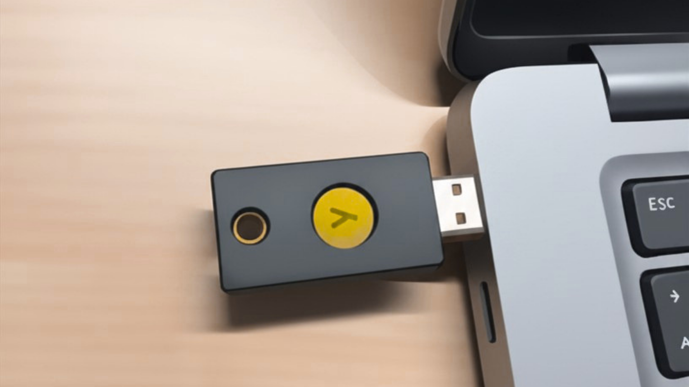
:::

:::{focus-on="cr-webauthn"}
**Hinweis:** Im Rahmen des Testbetriebs erhalten Sie die Hardware-Token vom RKI.
:::

:::

:::{.cr-section layout="sidebar-right"}

:::{focus-on="cr-need"}
[Teil 2 · Ersteinrichtung]{.idm-kicker}

## Schritt-für-Schritt-Anleitung

Diese Schritt-für-Schritt-Anleitung führt Sie durch den Authentifizierungsprozess.

### Was Sie benötigen

Bevor Sie beginnen, stellen Sie bitte sicher, dass Ihnen folgende Dinge zur Verfügung stehen:

1. Die **Willkommens-Mail** von EMIGA *(die Identitätsadministration Ihrer Einrichtung muss Ihr Konto initial anlegen, damit Sie die automatische Einladungsmail erhalten)*
2. Ein **Passkey** *(in diesem Fall ein physischer Sicherheitsschlüssel)*
3. Das **Gerät**, mit dem Sie die Erstanmeldung durchführen möchten
:::

:::{#cr-need .scale-to-fill}
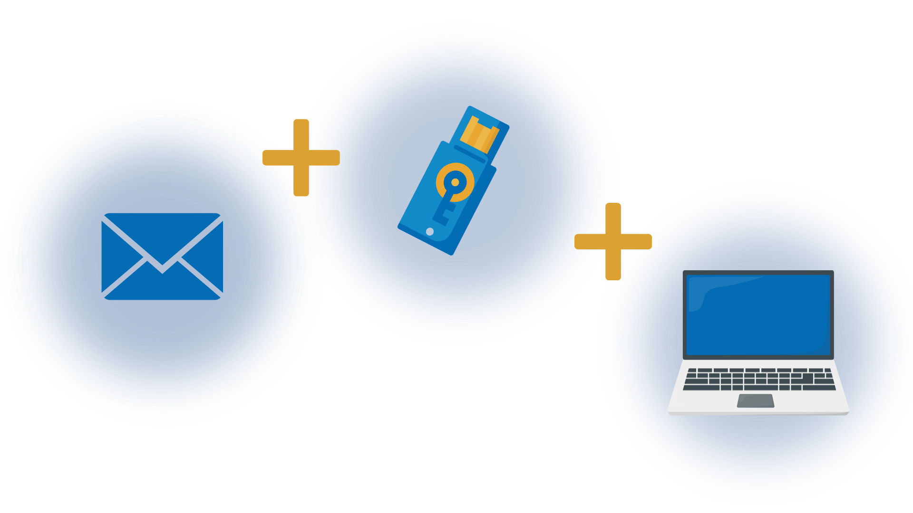
:::

:::{focus-on="cr-step-email"}
### E-Mail

Nachdem Ihr Nutzendenkonto von einer Identitätsadministration angelegt wurde, erhalten Sie eine E-Mail.

Klicken Sie auf die Schaltfläche „Zur Registrierung".
:::

:::{#cr-step-email .scale-to-fill}
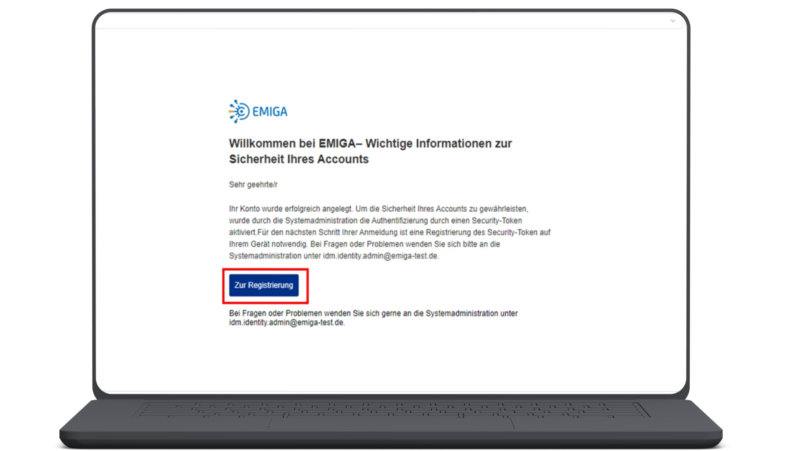
:::

:::{focus-on="cr-step-actions"}
### Auszuführende Aktionen

In der Anwendung sehen Sie eine Auflistung aller Aktionen, die auszuführen sind, um sich erstmalig anmelden zu können. In diesem Fall:

- E-Mail-Adresse verifizieren
- Kennwortlose Authentifizierung einrichten

Unten sehen Sie einen Link, auf den Sie als nächstes klicken.
:::

:::{#cr-step-actions .scale-to-fill}
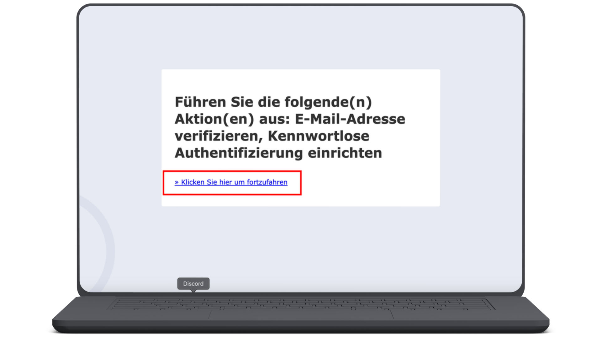
:::

:::{focus-on="cr-step-register"}
### Security Token registrieren

Als nächstes registrieren Sie Ihren Security Token. Damit ist Ihr Sicherheitsschlüssel, der sogenannte Hardware-Token, gemeint.

Klicken Sie dazu auf die Schaltfläche „Registrieren".
:::

:::{#cr-step-register .scale-to-fill}
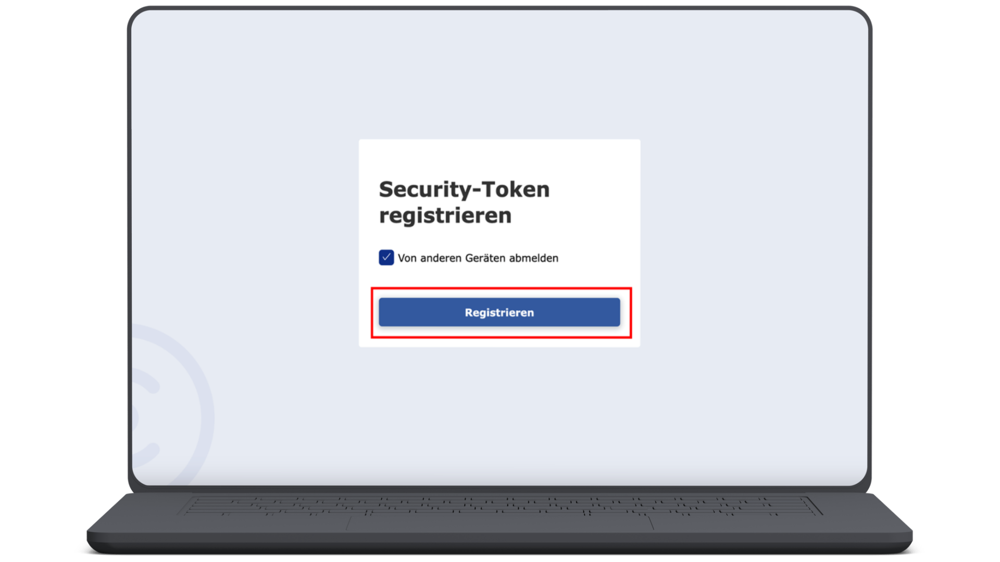
:::

:::{focus-on="cr-step-setup-confirm"}
### Setup bestätigen

Es öffnet sich ein Abfragefenster, in dem Sie das Fortsetzen des Setups bestätigen müssen. Klicken Sie dazu auf „OK".
:::

:::{#cr-step-setup-confirm .scale-to-fill}
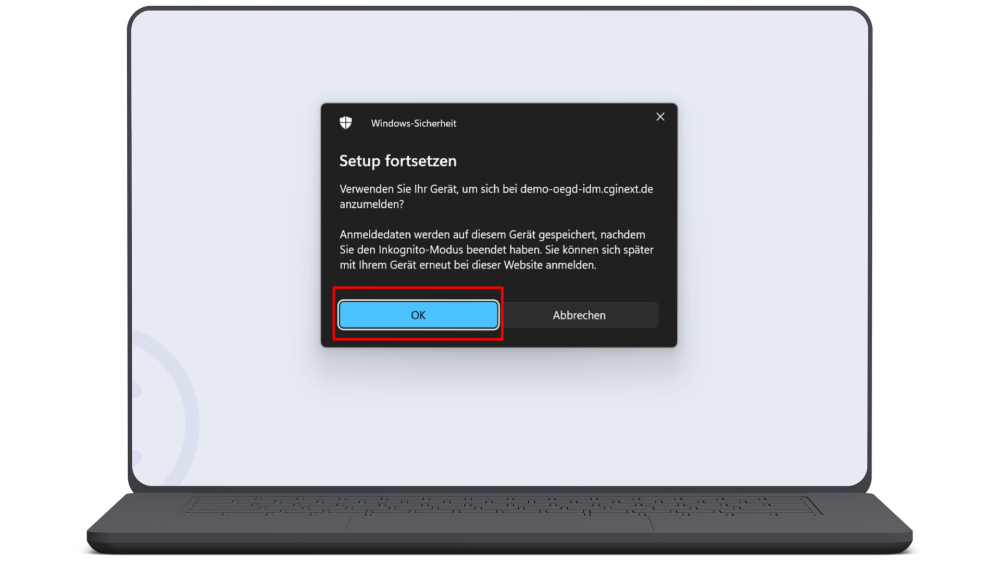
:::

:::{focus-on="cr-step-location"}
### Speicherort auswählen

Nun wählen Sie aus, wo der Hauptschlüssel gespeichert werden soll.

Zur Webauthentifizierung mit einem Sicherheitsschlüssel wählen Sie die Option „Sicherheitsschlüssel" und klicken auf „Weiter".
:::

:::{#cr-step-location .scale-to-fill}
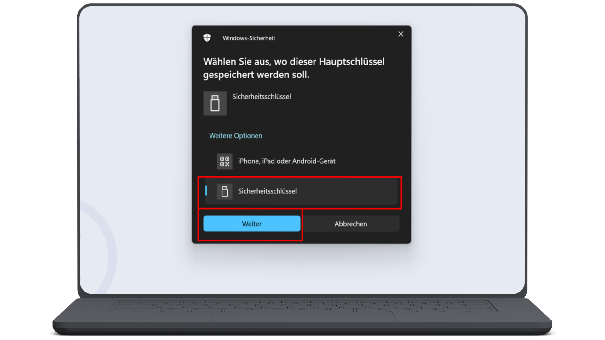
:::

:::{focus-on="cr-step-confirm2"}
### Bestätigen

Nun erscheint erneut ein Abfragefenster, in dem Sie die Einrichtung des Sicherheitsschlüssels bestätigen müssen. Klicken Sie dazu auf „OK".
:::

:::{#cr-step-confirm2 .scale-to-fill}
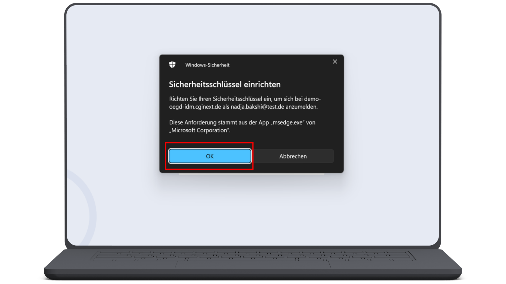
:::

:::{focus-on="cr-step-continue"}
### Fortsetzen

Sie sehen wieder ein Abfragefenster, in dem Sie erneut die Fortsetzung des Setups bestätigen, indem Sie auf „OK" klicken.
:::

:::{#cr-step-continue .scale-to-fill}
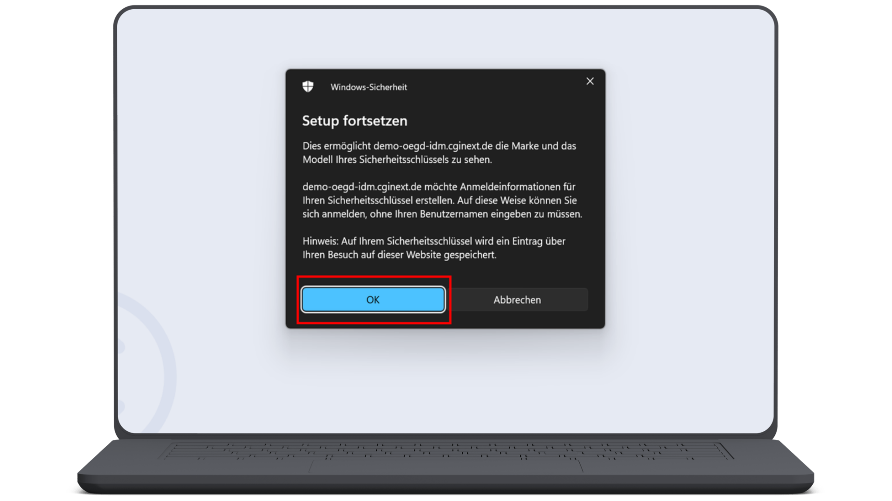
:::

:::{focus-on="cr-step-insert-prompt"}
### Aufforderung zur Einführung

Nun werden Sie aufgefordert, Ihren Sicherheitsschlüssel in Ihr Gerät einzuführen, um mit dem Setup fortzufahren.
:::

:::{#cr-step-insert-prompt .scale-to-fill}
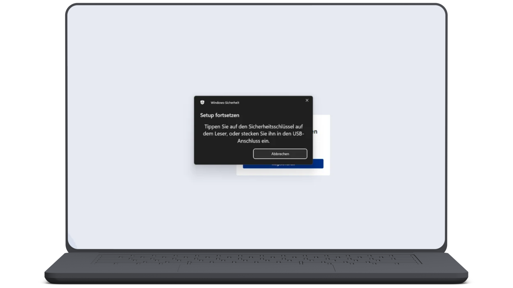
:::

:::{focus-on="cr-insert-token"}
### Sicherheitsschlüssel einführen

Führen Sie den Sicherheitsschlüssel in den USB-Eingang Ihres Computers ein.
:::

:::{#cr-insert-token .scale-to-fill}

:::

:::{focus-on="cr-step-tap"}
### Auf Sicherheitsschlüssel tippen

Nun werden Sie dazu aufgefordert, auf den Sicherheitsschlüssel zu tippen.
:::

:::{#cr-step-tap .scale-to-fill}

:::

:::{focus-on="cr-step-pin-set"}
### PIN festlegen

Im nächsten Schritt legen Sie eine von Ihnen gewählte PIN fest und bestätigen diese. Klicken Sie anschließend auf „OK".
:::

:::{#cr-step-pin-set .scale-to-fill}
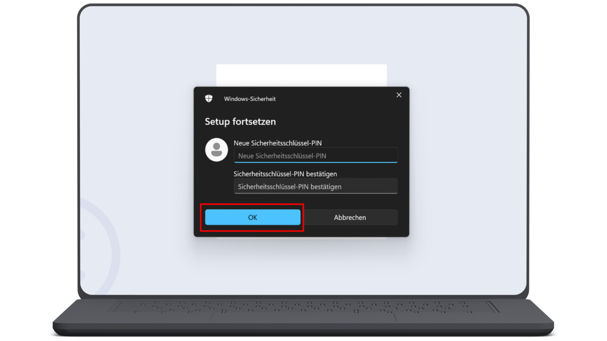
:::

:::{focus-on="cr-step-confirm3"}
### Bestätigung

Sie erhalten eine Bestätigung, dass Ihr Hauptschlüssel gespeichert wurde. Klicken Sie zur Bestätigung wieder „OK".
:::

:::{#cr-step-confirm3 .scale-to-fill}
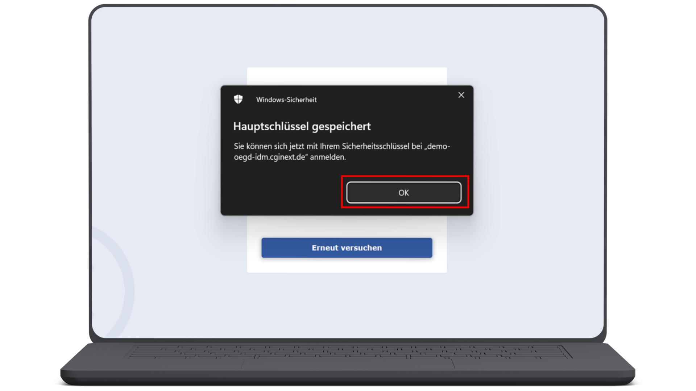
:::

:::{focus-on="cr-step-label"}
### Bezeichnung eingeben

Als nächstes geben Sie zur Geräteverwaltung eine Bezeichnung für den von Ihnen registrierten Passkey an und bestätigen diese mit „OK".
:::

:::{#cr-step-label .scale-to-fill}
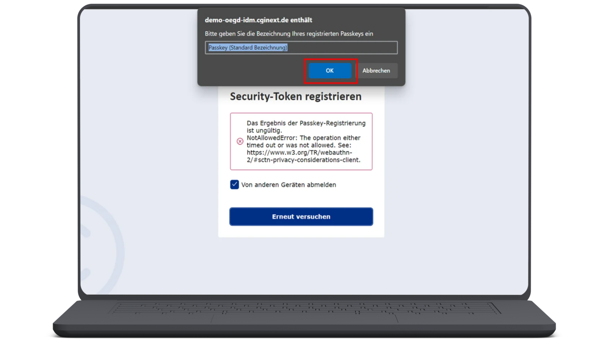
:::

:::{focus-on="cr-step-done1"}
### Einrichtung abgeschlossen

Sie sehen dann eine Bestätigung, dass Ihr Nutzendenkonto aktualisiert wurde.

Nun haben Sie Ihr Nutzendenkonto und den Sicherheitsschlüssel erfolgreich eingerichtet. Der erste Schritt ist damit abgeschlossen.
:::

:::{#cr-step-done1 .scale-to-fill}
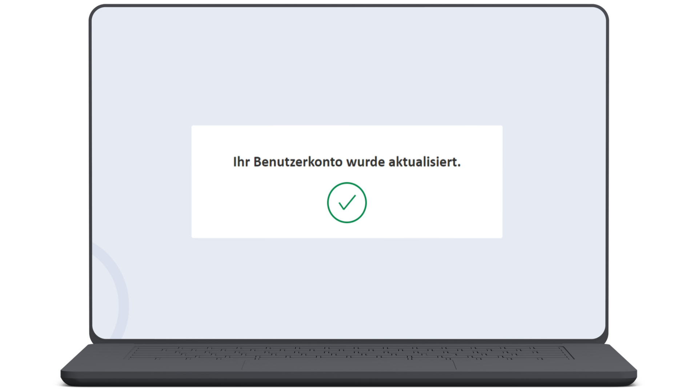
:::

:::

:::{.cr-section layout="sidebar-left"}

:::{focus-on="cr-step-open-app"}
[Teil 3 · Anmeldung]{.idm-kicker}

## Anmeldung in SurvNetEM

Nachdem Ihr Nutzendenkonto und Sicherheitsschlüssel eingerichtet sind, nutzen Sie diesen ab sofort bei jeder Anmeldung.

### Anwendung aufrufen

Im zweiten Schritt nutzen Sie den konfigurierten Sicherheitsschlüssel, um sich in EMIGA bzw. SurvNetEM anzumelden.

Rufen Sie dazu SurvNetEM auf. In der angezeigten Eingabemaske geben Sie zunächst Ihre E-Mail-Adresse ein und klicken Sie auf „Anmelden".
:::

:::{#cr-step-open-app .scale-to-fill}
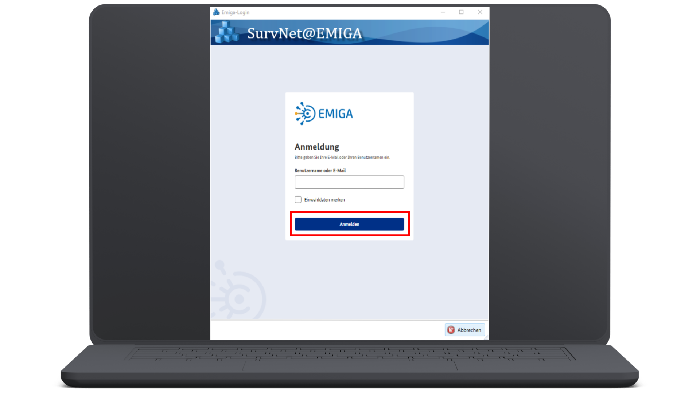
:::

:::{focus-on="cr-step-mfa"}
### Authentifizierung mit Sicherheitsschlüssel

Als nächstes ist die Multi-Faktor-Authentifizierung über den Sicherheitsschlüssel erforderlich.

Klicken Sie dazu auf „Weiter mit Security Token".
:::

:::{#cr-step-mfa .scale-to-fill}
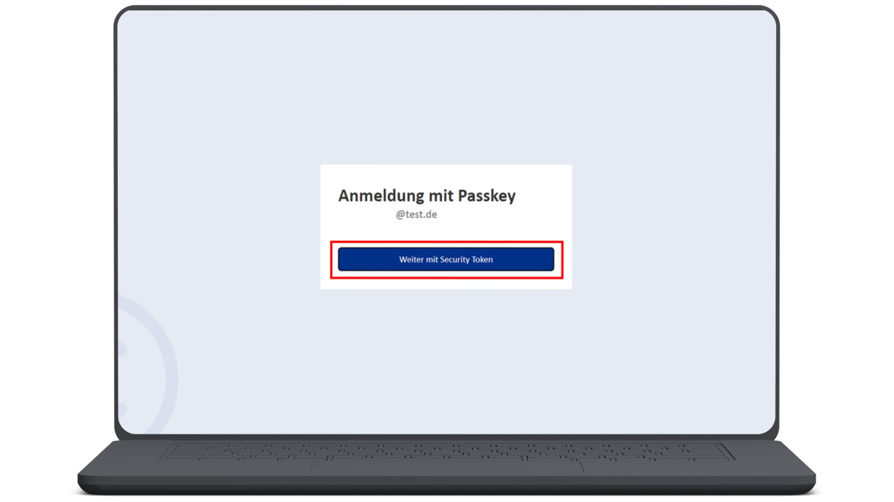
:::

:::{focus-on="cr-step-select-key"}
### Sicherheitsschlüssel auswählen

Jetzt erscheint ein Abfragefenster, in dem Sie „Sicherheitsschlüssel" als Gerät auswählen und zur Bestätigung „Weiter" klicken.
:::

:::{#cr-step-select-key .scale-to-fill}
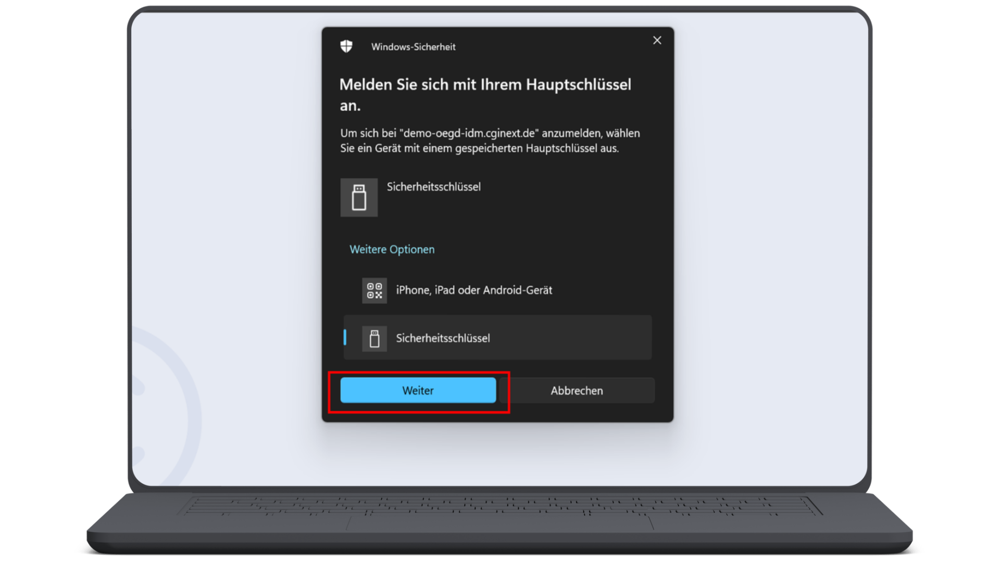
:::

:::{focus-on="cr-step-pin-enter"}
### PIN eingeben

Geben Sie nun den PIN ein, den Sie bei der Konfiguration des Sicherheitsschlüssels ausgewählt haben, und klicken Sie anschließend auf „OK".
:::

:::{#cr-step-pin-enter .scale-to-fill}
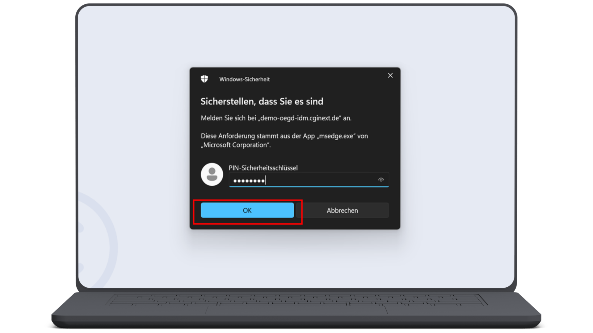
:::

:::{focus-on="cr-step-tap-hint"}
### Hinweis für Sicherheitsschlüssel

Anschließend erscheint ein Hinweis, der Sie auffordert, auf Ihren Sicherheitsschlüssel zu tippen.
:::

:::{#cr-step-tap-hint .scale-to-fill}
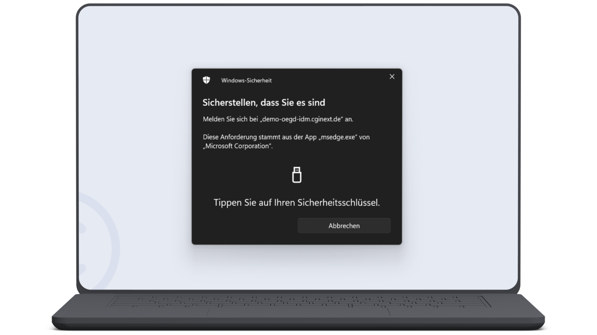
:::

:::{focus-on="cr-step-tap2"}
### Auf Sicherheitsschlüssel tippen

Tippen Sie nun auf den Sicherheitsschlüssel.
:::

:::{#cr-step-tap2 .scale-to-fill}
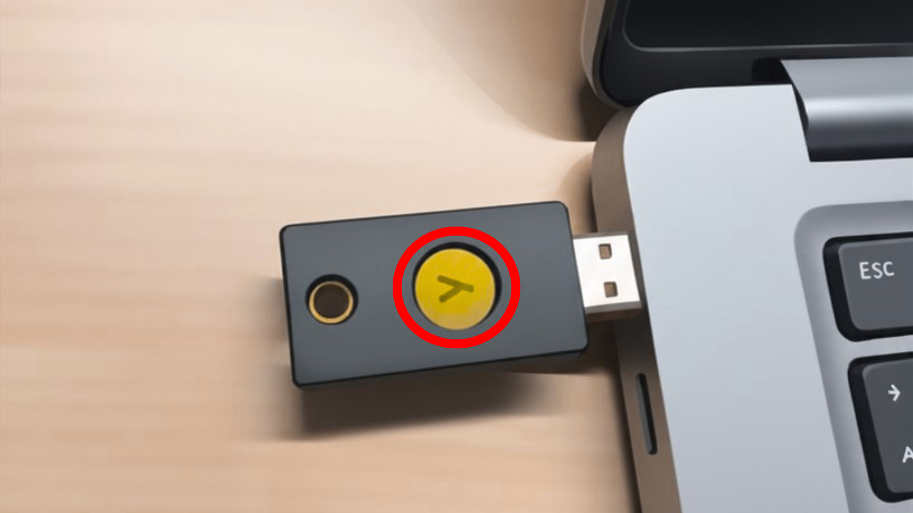
:::

:::{focus-on="cr-step-complete"}
### Anmeldung abgeschlossen

Nachdem Sie auf Ihren Sicherheitsschlüssel getippt haben, ist die Anmeldung abgeschlossen und Sie haben sich erfolgreich angemeldet.

Sie befinden sich nun in SurvNetEM und können mit Ihrer Arbeit starten.
:::

:::{#cr-step-complete .scale-to-fill}
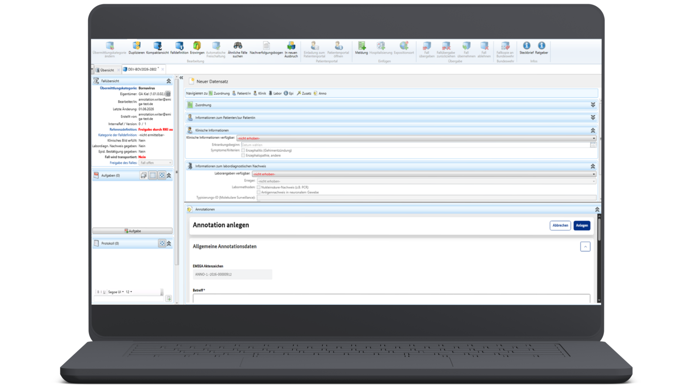
:::

:::

:::{.cr-section layout="sidebar-right"}

:::{focus-on="cr-locked"}
[Teil 4 · Konto gesperrt & zurücksetzen]{.idm-kicker}

## Konto gesperrt

### Was kann ich tun, wenn das EMIGA-Konto nach mehrmaliger fehlgeschlagener Anmeldung gesperrt wurde?

Wenn Sie zu oft eine falsche PIN eingegeben haben, kann es passieren, dass das EMIGA-Konto aus Sicherheitsgründen gesperrt wird. Um die Kontrolle über Ihr Konto zurückzuerlangen, haben Sie verschiedene Optionen:
:::

:::{#cr-locked .scale-to-fill}

:::

:::{focus-on="cr-locked"}
**Zu oft falsch angemeldet?** Wenden Sie sich an die **Identitätsadministration** Ihrer ÖGD-Stelle. Diese kann Ihre Authentifizierung zurücksetzen, und Sie können den Registrierungsprozess erneut durchlaufen.

**PIN vergessen?** In diesem Fall können Sie den PIN und den Hardware-Token komplett zurücksetzen (auf die Werkseinstellungen). Dies ist über die Windows-Einstellungen möglich — die Schritte dazu finden Sie im Folgenden.
:::

:::{focus-on="cr-reset-connect"}
## Konto zurücksetzen

Wenn Sie „Reset" auswählen, ist der Sicherheitsschlüssel komplett zurückgesetzt.

Das heißt, **jeglicher gespeicherte Zugang**, der über den Schlüssel läuft (auch neben EMIGA), ist gelöscht. Sie sollten also genau überlegen, ob Sie diesen Schritt gehen möchten.

Anschließend muss der Sicherheitsschlüssel für EMIGA und alle weiteren Dienste, die damit genutzt wurden, **neu eingerichtet werden**.

### Hardware-Token an den Computer anschließen
:::

:::{#cr-reset-connect .scale-to-fill}

:::

:::{focus-on="cr-reset-settings"}
### Die Windows-Einstellungen öffnen
:::

:::{#cr-reset-settings .scale-to-fill}
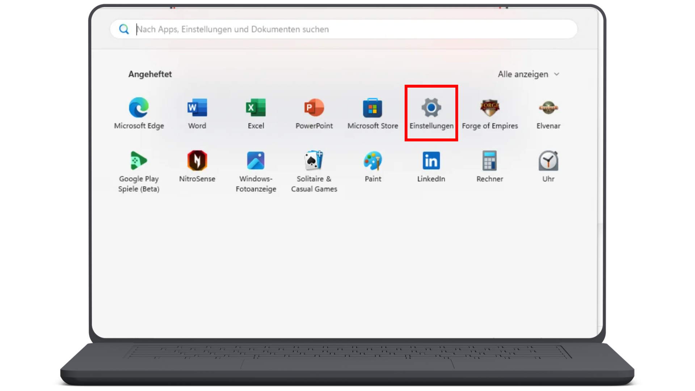
:::

:::{focus-on="cr-reset-accounts"}
### „Konten" und „Anmeldeoptionen" auswählen
:::

:::{#cr-reset-accounts .scale-to-fill}
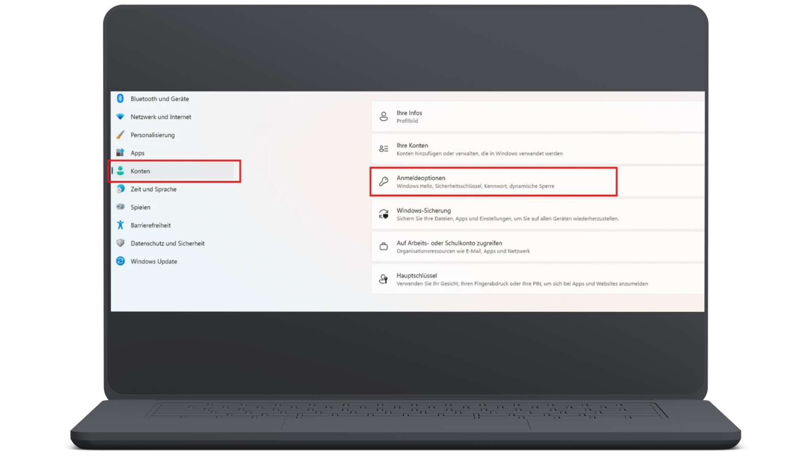
:::

:::{focus-on="cr-reset-manage"}
### Sicherheitsschlüssel auswählen und auf „Verwalten" klicken

In dem sich öffnenden Fenster können Sie den Schlüssel zurücksetzen.
:::

:::{#cr-reset-manage .scale-to-fill}
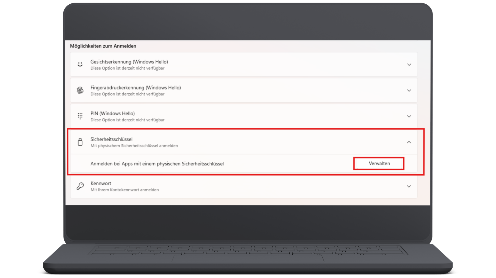
:::

:::

:::{.cr-section layout="sidebar-left"}

:::{focus-on="cr-support"}
[Teil 5 · Support]{.idm-kicker}

## Support

### Wen kann ich kontaktieren, wenn ich Hilfe benötige?

Bei **organisatorischen oder fachlichen Rückfragen** wenden Sie sich gerne an die folgende Mailadresse:\
[emiga@rki.de](mailto:emiga@rki.de)

Bei **technischen Rückfragen oder Problemen** mit dem Identitätsmanagement wenden Sie sich gerne an die folgende Mailadresse:\
[support@emiga-rki.de](mailto:support@emiga-rki.de)
:::

:::{#cr-support .scale-to-fill}

:::

:::{focus-on="cr-support"}
Sie können sich alle Informationen zum Identitätsmanagement auf dieser Seite auch als PDF herunterladen:\
[EMIGA_IDM_Standardnutzende_Infomaterial_v2.pdf](files/EMIGA_IDM_Standardnutzende_Infomaterial_v2.pdf)

### Fragen, Kritik oder Lob?

Füllen Sie gerne die Umfrage zur Evaluation des Materials aus:\
[zur Umfrage](https://survey-aoegw.de/index.php/852719?lang=de)

Sie haben das Ende des Materials erreicht.
:::

:::

::: {.idm-quiz}

<h2>Kurzer Wissens-Check</h2>

Testen Sie, was von der Anleitung hängengeblieben ist. Die Auswertung erfolgt direkt in Ihrem Browser, es werden keine Daten übertragen.

<form id="idm-quiz-form">

<fieldset class="idm-quiz-question">
<legend>1. Wofür steht die Abkürzung „IDM"?</legend>
<label><input type="radio" name="q1" value="a"> Internes Diagnose-Modul</label>
<label><input type="radio" name="q1" value="b" data-correct="true"> Identitätsmanagement</label>
<label><input type="radio" name="q1" value="c"> Interner Datenmanager</label>
</fieldset>

<fieldset class="idm-quiz-question">
<legend>2. Welchen Anmeldestandard nutzt EMIGA zur Authentifizierung?</legend>
<label><input type="radio" name="q2" value="a"> OAuth</label>
<label><input type="radio" name="q2" value="b"> SAML</label>
<label><input type="radio" name="q2" value="c" data-correct="true"> WebAuthn</label>
</fieldset>

<fieldset class="idm-quiz-question">
<legend>3. Was ist der Passkey bei EMIGA konkret?</legend>
<label><input type="radio" name="q3" value="a"> Eine SMS mit Einmalcode</label>
<label><input type="radio" name="q3" value="b" data-correct="true"> Ein physischer Sicherheitsschlüssel (Hardware-Token)</label>
<label><input type="radio" name="q3" value="c"> Ein Fingerabdruck-Scan</label>
</fieldset>

<fieldset class="idm-quiz-question">
<legend>4. Was passiert, wenn Sie den Sicherheitsschlüssel per „Reset" zurücksetzen?</legend>
<label><input type="radio" name="q4" value="a"> Nur der EMIGA-Zugang wird gelöscht</label>
<label><input type="radio" name="q4" value="b"> Es wird nur die PIN zurückgesetzt</label>
<label><input type="radio" name="q4" value="c" data-correct="true"> Der gesamte gespeicherte Zugang wird gelöscht, auch für andere Dienste</label>
</fieldset>

<fieldset class="idm-quiz-question">
<legend>5. An wen wenden Sie sich bei technischen Problemen mit dem Identitätsmanagement?</legend>
<label><input type="radio" name="q5" value="a"> emiga@rki.de</label>
<label><input type="radio" name="q5" value="b" data-correct="true"> support@emiga-rki.de</label>
<label><input type="radio" name="q5" value="c"> Die Windows-Einstellungen</label>
</fieldset>

<button type="submit" class="idm-quiz-submit">Auswertung anzeigen</button>

</form>

:::

::: {.idm-footer}
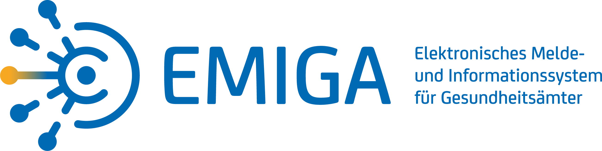{.idm-footer-logo}

{.idm-footer-banner}

{.idm-footer-banner}
:::

